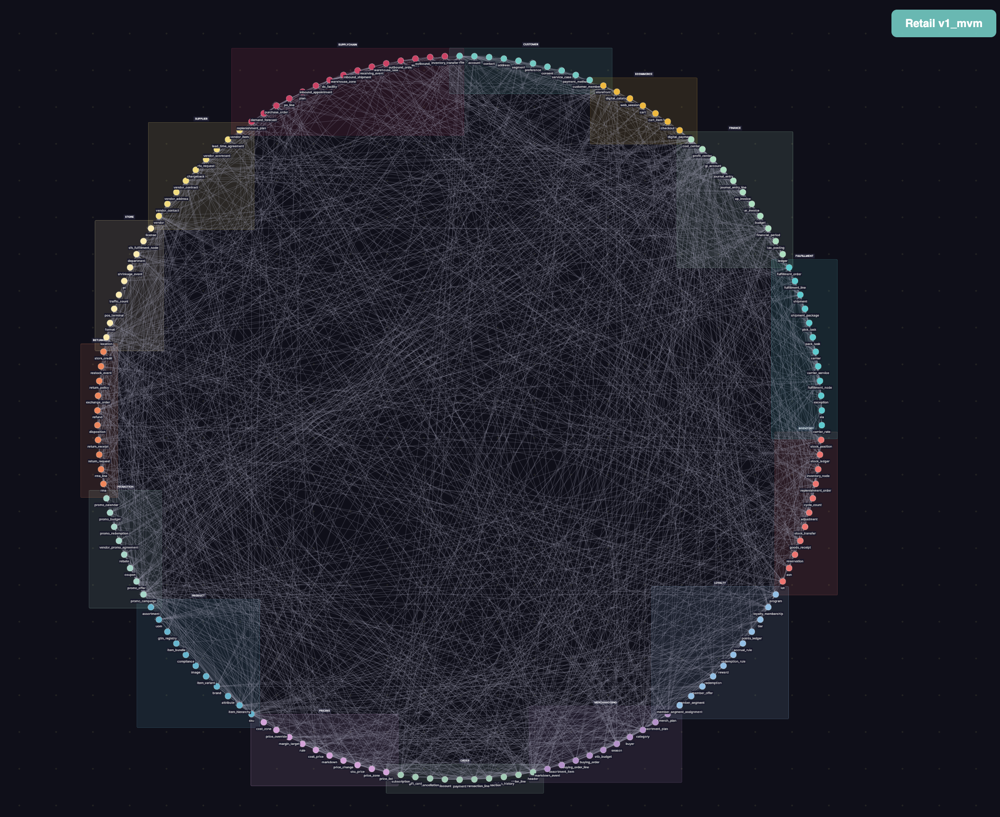
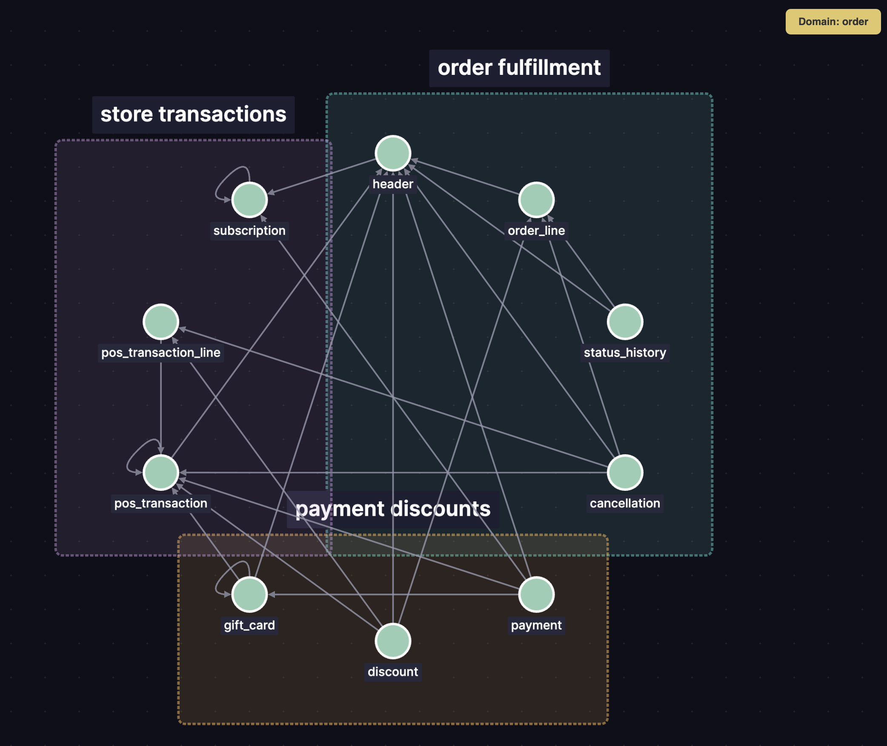
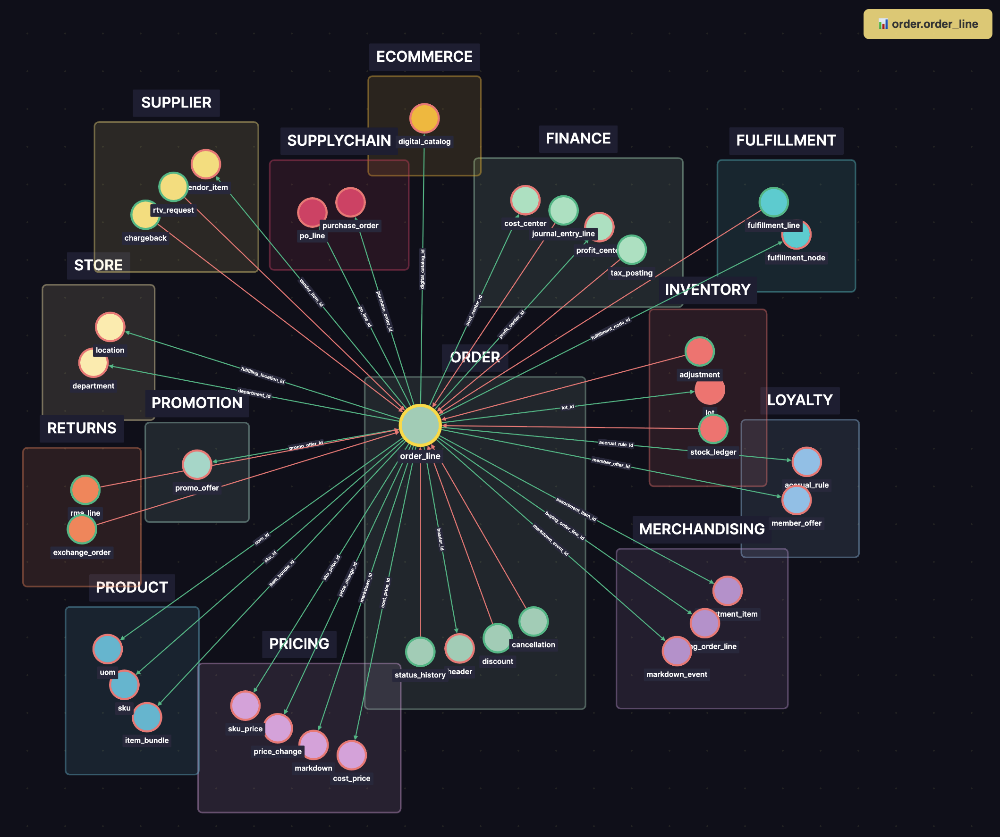

# vibe-business-data-models

Forty production-ready industry data models, each shipped in two flavours (ECM + MVM) — auto-generated by the **[vibe-modelling-agent](https://github.com/amralieg/vibe-modelling-agent)**, an LLM-powered pipeline that turns a one-paragraph business description into a Unity-Catalog-ready model with schemas, foreign keys, sample data, metric views, ontology tags, and DBML diagrams.

**40 industries · 80 models · 23,918 tables · 924,919 attributes · 167,214 foreign keys · 10,488 metric views**

---

## At a glance

| Metric | ECM | MVM | Combined |
|---|---:|---:|---:|
| Industries shipped | 40 | 40 | **40 / 40** |
| Models published | 40 | 40 | **80** |
| Domains | 720 | 560 | 1,280 |
| Sub-domains | 2,504 | 1,600 | 4,104 |
| Tables / data products | 16,510 | 7,408 | **23,918** |
| Attributes / columns | 616,056 | 308,863 | **924,919** |
| Foreign-key relationships | 98,640 | 68,574 | **167,214** |
| Metric views (BI-ready) | 5,653 | 4,835 | **10,488** |
| Distinct ontology tags | 859 | 643 | 1,502 |
| Avg attributes / table | 37.3 | 41.7 | — |
| Avg FKs / table | 5.97 | 9.26 | — |
| Avg tables / domain | 22.9 | 13.2 | — |

MVM ≈ 45% of ECM by table count, but retains 50% of attributes and 70% of FK relationships — confirming the MVM keeps the most join-heavy entities while shedding low-traffic reference tables.

---

## How to view a model

The fastest way to explore one of these models visually is the **model-viewer app**, a Databricks App that renders any `model.json` as an interactive entity-relationship graph with three navigable views (full model, domain, single product).

### Step 1 — Install the viewer app

1. Download the installer notebook from the agent repo: [`viewer/model_viewer_app_installer.ipynb`](https://github.com/amralieg/vibe-modelling-agent/blob/main/viewer/model_viewer_app_installer.ipynb).
2. Import the notebook into your Databricks workspace and run all cells. The installer provisions a Databricks App and prints the app URL when it finishes.

### Step 2 — Load a model

Open the app URL. You have two ways to load any model from this repo:

- **Load from repo** — paste `amralieg/vibe-business-data-models` and pick the industry + flavour from the dropdown. Note: GitHub sometimes rate-limits anonymous API calls — if you hit a 429 / "rate limit exceeded" message, fall back to the second option.
- **Load from JSON** — navigate to the industry folder in this repo (e.g. [`retail/mvm_v1/`](./retail/mvm_v1/)), download `model.json`, and click **Load from JSON** in the app to upload it directly.

### What you see in the viewer

**Full-model overview** — every entity in the model arranged on a single canvas, with every foreign-key relationship drawn between them. Domains are colour-coded (each rectangle is one domain) and products sit on the perimeter:



**Domain drill-down** — click any domain to zoom in. You see the domain's sub-domains as named groups and the products inside each, with the FK web restricted to within-domain links:



**Single-product radial view** — click any product (table) to centre it. The viewer fans out every other product it relates to via FK, grouped by domain, so you can see at a glance every join path leaving that table:



---

## What you get per industry

Each industry root folder ships **two flavours** of the same business domain:

- **`ecm_v1/` — Expanded Coverage Model.** Comprehensive, audit-grade model — the agent's source of truth. Covers every entity it can think of for the industry: operations, finance, regulatory, audit trail, reference data.
- **`mvm_v1/` — Minimum Viable Model.** Production-ready, demo-friendly subset derived from the ECM. Roughly 40-50% of the ECM's table count, retaining the most-used entities and FK paths. Recommended starting point for new deployments.

Both flavours are byte-identical in shape — same files, same structure, same Unity-Catalog deployment story. You pick the size that fits your use-case.

---

## Repository layout

```
<industry>/
├── readme.md                    # Industry-level summary (counts, vibe, generation metadata)
├── ecm_v1/
│   ├── readme.md                # ECM-specific summary + per-domain breakdown
│   ├── model.json               # Full agent model (single source of truth)
│   ├── _manifest.json           # Quality-gate manifest (counts, file inventory)
│   ├── schemas/                 # Per-table DDL (CREATE TABLE / CREATE VIEW)
│   ├── metrics/                 # Metric view SQL (one .sql per BI-ready metric view)
│   ├── samples/                 # Realistic sample-data CSVs sampled from each table
│   ├── ontology/                # Tag taxonomy + classification ontology JSON
│   ├── docs/                    # Per-domain markdown docs (auto-generated)
│   ├── diagram/                 # DBML + auto-rendered ER diagrams
│   └── vibes/                   # next_vibes.txt — auto-generated improvement priorities for v2
└── mvm_v1/
    └── (same structure as ecm_v1)
```

Top-level helper:

- **`models-info.csv`** — flat machine-readable manifest of every model with all the per-industry metrics so you can pick or compare programmatically.

---

## Quality gates — every model passes

Every shipped model was validated against the agent's `§9 model-level integrity contract`. Findings are split out per flavour so you can see the MVMs are entirely structurally clean.

| Check | ECM (40 models) | MVM (40 models) |
|---|---:|---:|
| FK cycles (graph SCC) | 0 | 0 |
| Bidirectional FK pairs | 0 | 0 |
| Dangling FKs (target product missing) | 0 | 0 |
| Self-FKs on primary keys | 0 | 0 |
| Siloed tables (no FK in or out) | 4 (1 each in 4 ECMs) | 0 |
| Cross-domain duplicate product names | 27 (1-6 each, mostly shared lookups) | 0 |
| Fidelity gates (Memory/JSON precision ≥ 0.85) | PASSED | PASSED |
| Manifest present (`_manifest.json`) | 40 / 40 | 40 / 40 |
| Per-version readme present | 40 / 40 | 40 / 40 |

All 40 MVMs ship with **zero structural findings** — they're clean across every check above. The 4 ECM silos and 27 ECM cross-domain name overlaps are the only outstanding items, all minor and called out individually in the *Known limitations* section.

---

## Headline highlights

**Top-5 biggest ECMs by attribute count:**

| Industry | Domains | Sub-domains | Tables | Attributes | FKs | Metric views |
|---|---:|---:|---:|---:|---:|---:|
| [Healthcare](./healthcare/ecm_v1/) | 22 | 78 | 541 | 22,423 | 4,093 | 104 |
| [Oil & Gas](./oil_gas/ecm_v1/) | 19 | 72 | 568 | 22,088 | 3,533 | 107 |
| [Sports & Entertainment](./sports_entertainment/ecm_v1/) | 19 | 75 | 473 | 21,075 | 4,474 | 180 |
| [Transport & Shipping](./transport_shipping/ecm_v1/) | 19 | 82 | 514 | 20,747 | 3,292 | 195 |
| [Banking](./banking/ecm_v1/) | 19 | 70 | 501 | 19,792 | 3,301 | 90 |

**Top-5 biggest MVMs by attribute count:**

| Industry | Domains | Sub-domains | Tables | Attributes | FKs | Metric views |
|---|---:|---:|---:|---:|---:|---:|
| [Oil & Gas](./oil_gas/mvm_v1/) | 17 | 45 | 246 | 11,143 | 2,664 | 93 |
| [Energy & Utilities](./energy_utilities/mvm_v1/) | 15 | 45 | 236 | 10,384 | 2,107 | 84 |
| [Banking](./banking/mvm_v1/) | 17 | 47 | 227 | 9,883 | 2,478 | 80 |
| [Life Insurance](./life_insurance/mvm_v1/) | 15 | 45 | 217 | 9,579 | 1,926 | 158 |
| [Transport & Shipping](./transport_shipping/mvm_v1/) | 14 | 45 | 210 | 9,524 | 1,918 | 122 |

**Most relationship-rich (densest FK graph):**

| Industry | Flavour | FKs | Tables | FKs / table |
|---|---|---:|---:|---:|
| [Sports & Entertainment](./sports_entertainment/ecm_v1/) | ECM | 4,474 | 473 | 9.46 |
| [Healthcare](./healthcare/ecm_v1/) | ECM | 4,093 | 541 | 7.57 |
| [Oil & Gas](./oil_gas/ecm_v1/) | ECM | 3,533 | 568 | 6.22 |
| [Oil & Gas](./oil_gas/mvm_v1/) | MVM | 2,664 | 246 | 10.83 |
| [Banking](./banking/mvm_v1/) | MVM | 2,478 | 227 | 10.92 |
| [Pharmaceuticals](./pharmaceuticals/mvm_v1/) | MVM | 2,423 | 213 | 11.38 |

**Most BI-ready (most metric views):**

| Industry | Flavour | Metric views | Tables |
|---|---|---:|---:|
| [Education](./education/ecm_v1/) | ECM | 237 | 446 |
| [Airlines](./airlines/ecm_v1/) | ECM | 231 | 424 |
| [Health Insurance](./health_insurance/ecm_v1/) | ECM | 222 | 409 |
| [Life Insurance](./life_insurance/mvm_v1/) | MVM | 158 | 217 |
| [Pharmaceuticals](./pharmaceuticals/mvm_v1/) | MVM | 147 | 213 |
| [Education](./education/mvm_v1/) | MVM | 143 | 203 |

**Deepest sub-domain hierarchy:**

| Industry | Flavour | Domains | Sub-domains | Sub-domains / domain |
|---|---|---:|---:|---:|
| [Transport & Shipping](./transport_shipping/ecm_v1/) | ECM | 19 | 82 | 4.3 |
| [Healthcare](./healthcare/ecm_v1/) | ECM | 22 | 78 | 3.5 |
| [Automotive](./automotive/ecm_v1/) | ECM | 19 | 75 | 3.9 |
| [Banking](./banking/mvm_v1/) | MVM | 17 | 47 | 2.8 |
| [Pharmaceuticals](./pharmaceuticals/mvm_v1/) | MVM | 15 | 47 | 3.1 |
| [Mining](./mining/mvm_v1/) | MVM | 15 | 46 | 3.1 |

---

## Industry index — full catalog

Click an industry name to jump to its folder.

### Financial Services & Insurance

| Industry | ECM Domains | ECM Products | MVM Domains | MVM Products |
|---|---:|---:|---:|---:|
| [Banking](./banking/) | 19 | 501 | 17 | 227 |
| [Payments & Fintech](./payments_fintech/) | 18 | 546 | 15 | 223 |
| [Health Insurance](./health_insurance/) | 19 | 409 | 15 | 189 |
| [Life Insurance](./life_insurance/) | 19 | 468 | 15 | 217 |

### Healthcare & Life Sciences

| Industry | ECM Domains | ECM Products | MVM Domains | MVM Products |
|---|---:|---:|---:|---:|
| [Healthcare](./healthcare/) | 22 | 541 | 16 | 189 |
| [Pharmaceuticals](./pharmaceuticals/) | 19 | 441 | 15 | 213 |
| [Genomics & Biotech](./genomics_biotech/) | 19 | 403 | 15 | 182 |
| [Clinical Trials](./clinical_trials/) | 19 | 379 | 13 | 193 |

### Travel & Logistics

| Industry | ECM Domains | ECM Products | MVM Domains | MVM Products |
|---|---:|---:|---:|---:|
| [Airlines](./airlines/) | 19 | 424 | 15 | 205 |
| [Travel & Hospitality](./travel_hospitality/) | 17 | 356 | 14 | 188 |
| [Transport & Shipping](./transport_shipping/) | 19 | 514 | 14 | 210 |
| [Shipping Ports](./shipping_ports/) | 19 | 395 | 14 | 186 |

### Energy & Resources

| Industry | ECM Domains | ECM Products | MVM Domains | MVM Products |
|---|---:|---:|---:|---:|
| [Oil & Gas](./oil_gas/) | 19 | 568 | 17 | 246 |
| [Energy & Utilities](./energy_utilities/) | 18 | 451 | 15 | 236 |
| [Mining](./mining/) | 18 | 416 | 15 | 219 |
| [Water Utilities](./water_utilities/) | 15 | 377 | 13 | 189 |

### Public Sector & Services

| Industry | ECM Domains | ECM Products | MVM Domains | MVM Products |
|---|---:|---:|---:|---:|
| [Education](./education/) | 17 | 446 | 14 | 203 |
| [NGO](./ngo/) | 15 | 302 | 12 | 141 |
| [Legal](./legal/) | 15 | 314 | 12 | 153 |
| [Waste Management](./waste_management/) | 17 | 471 | 12 | 194 |
| [Staffing & HR](./staffing_hr/) | 16 | 302 | 12 | 153 |
| [Real Estate](./real_estate/) | 16 | 344 | 14 | 177 |

### Communications, Media & Entertainment

| Industry | ECM Domains | ECM Products | MVM Domains | MVM Products |
|---|---:|---:|---:|---:|
| [Telecommunication](./telecommunication/) | 20 | 451 | 15 | 167 |
| [Media & Broadcasting](./media_broadcasting/) | 17 | 421 | 14 | 186 |
| [Sports & Entertainment](./sports_entertainment/) | 19 | 473 | 14 | 200 |
| [Gaming](./gaming/) | 17 | 396 | 14 | 176 |
| [Advertising](./advertising/) | 13 | 262 | 10 | 95 |

### Retail & Consumer

| Industry | ECM Domains | ECM Products | MVM Domains | MVM Products |
|---|---:|---:|---:|---:|
| [Retail](./retail/) | 19 | 401 | 15 | 154 |
| [Grocery](./grocery/) | 19 | 374 | 14 | 175 |
| [Ecommerce](./ecommerce/) | 18 | 369 | 14 | 148 |
| [Consumer Goods](./consumer_goods/) | 19 | 403 | 14 | 184 |
| [Apparel & Fashion](./apparel_fashion/) | 19 | 400 | 12 | 163 |
| [Food & Beverage](./food_beverage/) | 19 | 376 | 14 | 157 |
| [Restaurants](./restaurants/) | 14 | 292 | 13 | 153 |

### Manufacturing & Industrial

| Industry | ECM Domains | ECM Products | MVM Domains | MVM Products |
|---|---:|---:|---:|---:|
| [Manufacturing](./manufacturing/) | 20 | 413 | 12 | 129 |
| [Chemical Manufacturing](./chemical_mfg/) | 19 | 405 | 14 | 202 |
| [Semiconductors](./semiconductors/) | 19 | 385 | 14 | 211 |
| [Automotive](./automotive/) | 19 | 548 | 14 | 209 |
| [Construction](./construction/) | 18 | 365 | 15 | 189 |
| [Agriculture](./agriculture/) | 18 | 408 | 14 | 177 |

---

## How models are generated

1. **Vibe-modelling-agent** receives a one-paragraph business description (e.g. *"Agriculture — primary production, supply chain, finance, sustainability ..."*).
2. It runs an 8-stage pipeline using a per-stage **LLM ensemble + judge**:
   1. Tier classification → 2. Domain generation → 3. Sub-domain expansion → 4. Product (table) generation → 5. Attribute (column) generation → 6. FK linking → 7. Semantic dedup + naming → 8. Metric view + ontology synthesis.
3. Each stage is gated by structural validators (cycle detector, bidirectional-FK detector, dangling-FK detector, fidelity-precision gate) before the next stage starts.
4. Output is written to a Unity Catalog volume + workspace folder, then auto-pushed into this repo as one commit per industry.

See the [vibe-modelling-agent README](https://github.com/amralieg/vibe-modelling-agent) for the full pipeline architecture, prompt library, autofix passes, and validator catalogue.

---

## Provenance

- **Agent versions used:** v0.7.1 (31 industries) and v0.7.2 (9 industries) — single-digit semver per `CLAUDE.md §3a`.
- **Every `model.json`** carries a top-level `agent_version` field so you can correlate model shape to the producing agent revision.
- **Every commit** is one industry — search `git log --oneline | grep <industry>` to find it. Diffs across versions of the same industry stay reviewable.
- **`models-info.csv`** at the repo root is the flat machine-readable manifest of all per-model metrics.

---

## Known limitations

- **Sample data is synthetic.** The agent generates plausible-looking values, but never use them as ground truth for analytics; replace with real ingestion before going to production.
- **27 ECMs have cross-domain duplicate product names** (e.g. `party` shared across 4 domains in `payments_fintech/ecm_v1`). These are usually legitimate shared lookups but a future agent version may consolidate them under a single owning domain. **All 40 MVMs are clean of this.**
- **4 ECMs have one siloed product each** (`finance.ledger` in `education`, `facility.organization` in `healthcare`, `program.program` in `ngo`, `marine.pilotage_exemption` in `shipping_ports`). These are legitimate top-level reference entities that the agent didn't link out from. **All 40 MVMs are silo-free.**
- **Industry coverage is broad, not deep.** The ECMs aim for 70-80% of an enterprise's domain shape; the last 20-30% (organisation-specific extensions, third-party integrations) is a follow-up vibe-iteration the agent can take on.

---

## License

These models are auto-generated and provided as-is for reference. Industry standards evolve; verify against your organisation's specific business rules and regulatory context before production use.

---

*40 industries · 80 models · 23,918 tables · 924,919 attributes · structural integrity 80/80 clean.*

---
